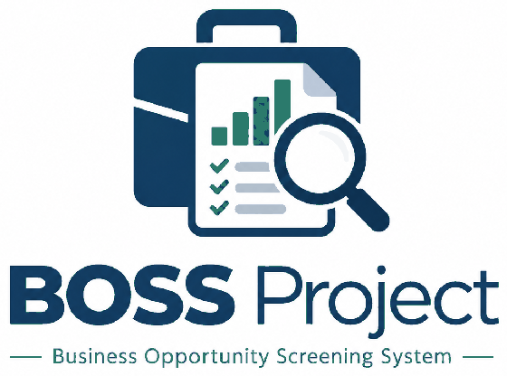
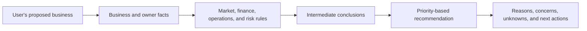
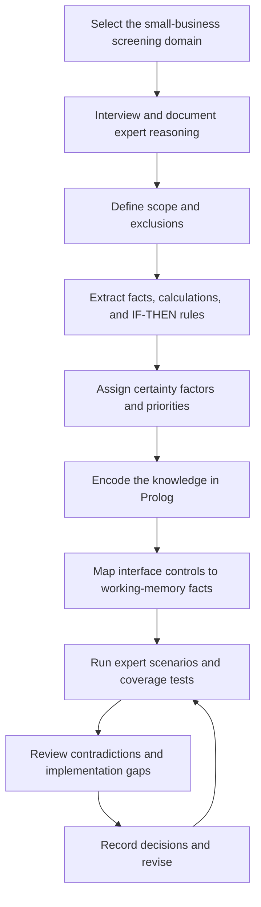
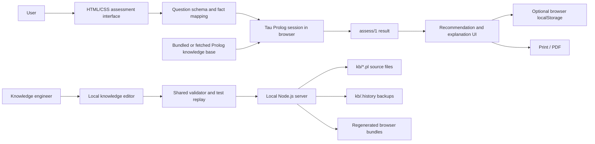
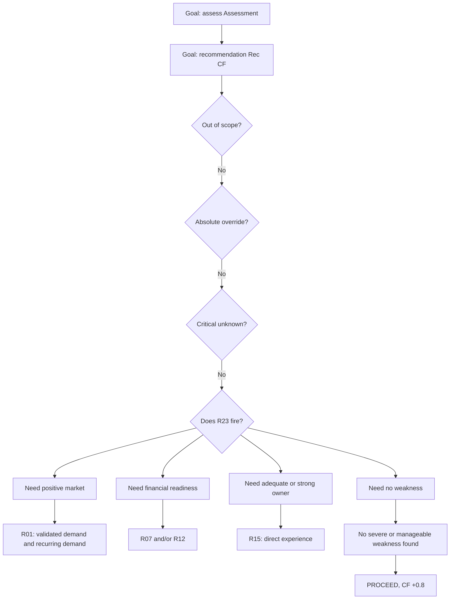
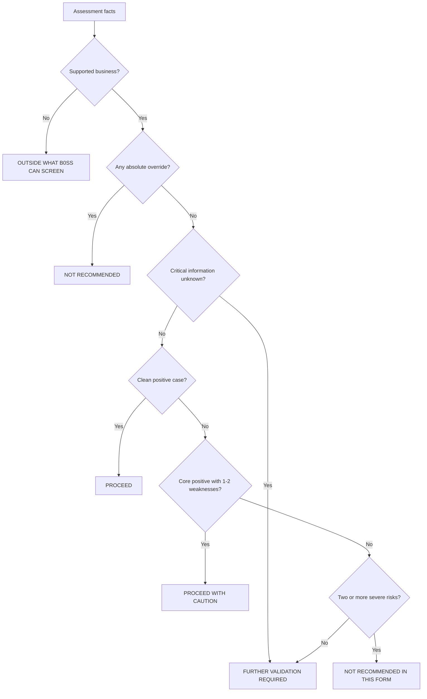

# B0SS - Business Opportunity Screening System

## An Explainable Rule-Based Expert System for Preliminary Business Opportunity Evaluation



**Module:** Logic Programming and Artificial Cognitive Systems  
**Module code:** CM3321  
**Student:** Kularathna GGAS  
**Student index:** 224110P  
**Lecturer:** `[Add lecturer name]`  
**Department / university:** `[Add department and university]`  
**Knowledge-domain expert:** `[Add the expert's full name]`  
**Report date:** 27 September 2026  
**Deployed system:** [https://adeepak2.github.io/BOSS-Expert-System/](https://adeepak2.github.io/BOSS-Expert-System/)

> **Submission note:** This report is grounded in the current repository and the project's Software Requirements Specification (SRS). Before submission, replace all bracketed fields, add the expert-interview and validation dates, insert the recommended screenshots, and record the expert's final sign-off.

---

## Abstract

B0SS, the Business Opportunity Screening System, is a browser-based expert system that gives a structured first-pass assessment of a proposed small business. The system addresses the difficulty faced by first-time entrepreneurs and small-business owners when they must evaluate interacting factors such as paying demand, competition, owner readiness, startup capital, cash flow, household runway, operational dependency, and licensing. B0SS does not attempt to predict success. Instead, it applies an explicitly represented body of expert knowledge to identify whether the current proposal should proceed, proceed with caution, undergo further validation, or be rejected in its present form.

The knowledge base contains 25 fixed domain facts and 25 IF-THEN rules with certainty factors ranging from -1.0 to +1.0. User answers are converted into Prolog working-memory facts. Derived predicates calculate capital requirement, funded months, survival gap, margin category, critical unknowns, weaknesses, and severe risks. Tau Prolog executes the knowledge base directly in the browser. The final assessment uses goal-directed backward chaining and a priority ladder that checks scope, absolute overrides, critical unknowns, positive conditions, manageable weaknesses, and severe risks. An exhaustive `fires/1` query is also used to collect every applicable rule for explanation, coverage checking, and a forward-style view of the facts-to-conclusions path.

The interface presents seven subject sections as nine short questions containing 15 user controls. Results include a recommendation, a certainty label and value, positive findings, concerns, missing information, suggested next actions, visible financial arithmetic, the decision path, and the complete triggered-rule trace. A separate local knowledge editor allows a knowledge engineer to maintain facts, rules, certainty factors, explanations, and actions. It validates the complete knowledge base and replays all test cases before saving.

Verification on 27 September 2026 confirmed that all eight validation scenarios produced their expected recommendations under Tau Prolog, all 24 interface-emitted fact names matched the declared working-memory predicates, all 25 expert rules fired across the test set, and all 25 fixed facts were used. The current knowledge-base checker reports no knowledge-base errors and four warnings. Its mutation-test wrapper still exits unsuccessfully because two mutation patterns are stale and are skipped; this is documented as remaining maintenance work.

---

## Table of Contents

1. [Introduction](#1-introduction)
2. [Domain Study and Knowledge Engineering](#2-domain-study-and-knowledge-engineering)
3. [Requirements, System Design, and Architecture](#3-requirements-system-design-and-architecture)
4. [Inference and Explanation Mechanisms](#4-inference-and-explanation-mechanisms)
5. [System Implementation](#5-system-implementation)
6. [Testing and Validation](#6-testing-and-validation)
7. [User Manual](#7-user-manual)
8. [Responsible Use, Limitations, and Future Improvements](#8-responsible-use-limitations-and-future-improvements)
9. [Conclusion](#9-conclusion)
10. [References](#10-references)
11. [Appendices](#appendix-a---complete-rule-catalogue)

---

# 1. Introduction

## 1.1 Background

An expert system is a knowledge-based program designed to reproduce a limited part of the reasoning performed by a human specialist. A conventional rule-based expert system separates domain knowledge from the software that presents questions and results. Facts describe the domain or the current case, rules describe how conclusions follow from those facts, and an inference mechanism determines which conclusions are supported.

Business opportunity screening is suitable for this approach because an experienced advisor often works through a repeatable set of questions. Evidence of paying demand, owner capability, available capital, personal runway, competition, operational feasibility, and legal constraints do not operate independently. Some conditions are positive evidence, some are manageable weaknesses, and a smaller group are decisive blockers. Encoding these judgements as rules makes the reasoning visible and repeatable instead of hiding it inside an unexplained score.

B0SS was developed as a symbolic and explainable system rather than a statistical or machine-learning model. It does not learn from historical business outcomes and does not call an external artificial-intelligence service. Its conclusions come only from the user's answers, fixed domain facts, arithmetic derivations, and the 25 expert rules stored in the Prolog knowledge base.

## 1.2 Problem Statement

Evaluating a new small-business opportunity requires several related questions to be considered at the same time:

- Has a real customer demonstrated willingness to pay?
- Is the selling price accepted or at least benchmarked?
- Can the owner perform or supervise the core work?
- Is the business funded through startup and its early operating period?
- Can the household survive until the business reaches break-even?
- Is the proposal differentiated from competitors?
- Does it depend excessively on one customer, supplier, person, or platform?
- Can it legally operate in the proposed form?

People without business experience may focus on an attractive idea while overlooking cash-cycle problems, personal financial exposure, lack of evidence, or an irreversible commitment. A conventional questionnaire can collect answers but may not explain how those answers interact. B0SS therefore provides rule-based decision support that produces both a recommendation and an auditable explanation.

## 1.3 Aim

The aim of B0SS is to provide an explainable, rule-based first-pass screening of small-business opportunities and to identify the assumptions that must be validated before the user makes an irreversible commitment.

## 1.4 Objectives

The project objectives were to:

1. Acquire practical screening knowledge from a small-business advisor.
2. Represent the acquired knowledge as explicit Prolog facts, derived predicates, and IF-THEN rules.
3. Implement at least 20 facts and 20 rules while keeping knowledge separate from interface code.
4. Support goal-directed inference and expose the complete set of applicable rules.
5. Represent uncertainty using lecture-aligned certainty factors from -1.0 to +1.0.
6. Produce clear recommendations without presenting them as probabilities of business success.
7. Explain positive evidence, concerns, missing information, calculations, and next actions.
8. Provide a short, mobile-friendly browser interface that works without a backend.
9. Provide a separate knowledge-maintenance interface for the knowledge engineer.
10. Validate the system with representative scenarios and automated coverage checks.
11. Deploy only the public assessment interface as a static GitHub Pages site.

## 1.5 Scope

B0SS screens small service, retail, online, education, professional-service, food-and-beverage, and owner-operated trade businesses. It is intended for first-time entrepreneurs, existing small-business owners considering a new venture or branch, managers, students, and business advisors using a structured first-meeting checklist.

The system is designed for the idea stage, early validation, and the period before committing capital. It evaluates the current form of the proposal. A negative result can therefore mean that the scale, funding method, channel, dependency, or timing should change before the opportunity is assessed again.

B0SS deliberately excludes domains that require specialist regulatory, technical, actuarial, clinical, or high-capital judgement. Examples include pharmaceuticals, medical practice, financial services, insurance, alcohol and tobacco, firearms, large-scale import/export, capital-intensive manufacturing, agriculture, construction contracting, cryptocurrency or foreign-exchange trading, and franchise decisions whose economics are governed by a franchise agreement. It is also not intended for businesses with more than approximately 20 employees or capital above approximately LKR 25 million.

## 1.6 What the System Does Not Claim

B0SS does not:

- predict revenue, profit, failure, or a probability of success;
- analyse current market data automatically;
- provide legal, tax, accounting, investment, lending, or licensing advice;
- recommend taking a loan, pledging a home or asset, leaving employment, signing a lease, or choosing a legal structure;
- replace customer interviews, price tests, deposits, pre-orders, professional advice, or expert validation;
- convert an unknown demand, price, capital, or legal answer into a positive assumption.

A **PROCEED** result means only that the encoded screening rules do not currently identify a reason to stop further investigation.

---

# 2. Domain Study and Knowledge Engineering

## 2.1 Selected Domain

The selected domain is preliminary business opportunity screening for owner-managed small businesses. The domain is narrower than general business consulting. It focuses on whether a proposal has enough evidence and practical readiness to justify continued investigation.

The system's conceptual flow is:



## 2.2 Knowledge Acquisition

The primary knowledge source is the expert interview and design record captured in the repository's [Expert Knowledge Acquisition SRS](<B0SS — Business Opportunity Screening System SRS .pdf>). The stated expert profile is an independent small-business advisor and consultant with 14 years of experience, including owner-operation, mentoring, and advisory work across several small-business categories in Sri Lanka. The SRS captures:

- the expert's evaluation order;
- critical success and failure factors;
- immediate red flags and absolute deal-breakers;
- must-have conditions;
- compensating factors and exceptions;
- 25 fixed domain facts;
- 25 IF-THEN expert rules;
- certainty factors;
- expected recommendations; and
- six representative validation scenarios.

The implementation process exposed several areas where prose had to be converted into precise logic. These decisions are recorded in [DECISIONS.md](DECISIONS.md). Important examples include defining countable severe-risk and weakness categories, resolving rules that originally named two alternative conclusions, defining the handling of critical unknowns, and specifying a safe fall-through outcome when no final recommendation rule matches.

The expert's full name and validation dates remain placeholders in the SRS. Therefore, the knowledge should be described as *captured but awaiting final named-expert sign-off*, rather than as independently certified knowledge.

## 2.3 Knowledge Engineering Process

The project followed an iterative knowledge-engineering cycle:



This cycle is important because the SRS contained some statements that were meaningful to a human but not directly executable. For example, phrases such as "core factors are positive" and "at most two manageable weaknesses" required explicit definitions. The implementation introduced central `severe_risk/1` and `weakness/1` predicates so that these concepts could be counted consistently.

## 2.4 Knowledge Representation

The system uses five complementary forms of knowledge.

### 2.4.1 Fixed domain facts

The file [kb/boss_kb.pl](kb/boss_kb.pl) contains exactly 25 unconditional facts. They describe values that are valid in every assessment:

| Fact group | Count | Purpose |
|---|---:|---|
| Supported business types | 7 | Defines the businesses B0SS is permitted to screen |
| Safe funding sources | 3 | Identifies funding that does not automatically endanger the household |
| Dangerous funding sources | 3 | Activates the R10 absolute override |
| Demand evidence levels | 4 | Defines known demand-evidence categories |
| Cash-cycle types | 4 | Defines recognised cash-flow patterns |
| Legal-status values | 4 | Defines recognised licensing states |
| **Total** | **25** | Meets and exceeds the assignment minimum |

Representative facts are:

```prolog
supported_business(education).
safe_funding(own_savings).
dangerous_funding(pawned_asset).
demand_level(validated).
cash_cycle_type(advance_payment).
legal_value(blocking).
```

### 2.4.2 Working-memory facts

The file [kb/boss_derive.pl](kb/boss_derive.pl) declares 24 dynamic one-argument predicates for the facts supplied by one assessment. Examples include:

```prolog
business_type(education).
demand_evidence(validated).
owner_experience(direct).
startup_cost(60000).
capital_available(300000).
legal_status(none_required).
```

Each assessment runs in a new Tau Prolog session. The interface converts the answer sheet into Prolog clauses and consults those clauses together with the fixed knowledge base. The test scenarios currently emit between 22 and 24 working-memory facts depending on whether conditional values such as a funding rate or reversibility are applicable.

### 2.4.3 Derived values

Arithmetic and classification predicates calculate values that should not be asked as separate questions:

```text
capital requirement = startup cost + (6 x monthly operating cost)

funded months = max(0, capital available - startup cost)
                ------------------------------------------------
                         monthly operating cost

survival gap = funded months - expected break-even months
```

The same file derives margin categories, effective funding cost, domain scope, recognised values, and critical unknowns. A required value is allowed to fail when it is absent; the implementation does not invent a default.

### 2.4.4 Expert rules

The file [kb/boss_rules.pl](kb/boss_rules.pl) contains 25 rules in the form specified by the SRS:

```prolog
rule(r01, market_attractiveness(high), 0.8) :-
    demand_evidence(validated),
    repeat_demand(recurring).

rule(r21, recommendation(not_recommended), -1.0) :-
    legal_status(blocking).
```

The rule head stores a rule identifier, conclusion, and certainty factor. The body stores the supporting evidence. Rules that produce both a conclusion and a flag use an `and/2` term, which is unfolded by the inference layer.

### 2.4.5 Presentation knowledge

Plain-language rule explanations, next actions, missing-information labels, certainty labels, decision-gate labels, and verdict text are stored in [kb/boss_advice.pl](kb/boss_advice.pl). Keeping this language in the knowledge base allows the knowledge engineer to update an explanation without placing business knowledge in the interface code.

## 2.5 Knowledge-Base Summary

| Knowledge element | Implemented quantity | Main file |
|---|---:|---|
| Fixed domain facts | 25 | `kb/boss_kb.pl` |
| Working-memory predicates | 24 | `kb/boss_derive.pl` |
| Expert rules | 25 | `kb/boss_rules.pl` |
| Rule levels | 25 mappings | `kb/boss_infer.pl` |
| Primary recommendations | 4 | `kb/boss_advice.pl` |
| Additional negative subtype | 1 | `kb/boss_advice.pl` |
| Validation scenarios | 8 | `test/cases.pl` |
| User-interface sections | 7 | `web/schema.js` |
| Questions | 9 | `web/schema.js` |
| User controls | 15 | `web/schema.js` |

## 2.6 Knowledge Validation and Traceability

Traceability is maintained in several ways:

- every rule has a stable identifier from R01 to R25;
- every rule has a certainty factor and plain-language explanation;
- negative rules can have a specific next action;
- rule levels prevent unsafe recursive dependencies;
- the decision path is derived from the same checks as the recommendation;
- the trace is generated from rules that actually fire;
- interface facts are tested against the real Prolog knowledge base;
- every fixed fact and every expert rule is exercised by the combined test cases; and
- implementation decisions are documented rather than silently embedded in code.

---

# 3. Requirements, System Design, and Architecture

## 3.1 Functional Requirements

The implementation addresses the SRS functional requirements as follows:

| Requirement area | Implemented behaviour |
|---|---|
| Start a screening | A new assessment can be started from the landing page |
| Identify venture type | New business or branch is captured with the channel choice |
| Collect domain inputs | Seven sections, nine questions, and 15 controls cover all rule inputs |
| Represent unknowns | Critical questions include explicit unknown states |
| Derive values | Capital requirement, funded months, survival gap, margin level, and risk counts are calculated |
| Apply expert knowledge | 25 rules and their certainty factors are consulted by Tau Prolog |
| Produce recommendations | Four main categories and one negative subtype are supported |
| Explain the result | The result includes reasons, concerns, missing information, actions, arithmetic, path, and trace |
| Reassess | The user can change an answer and immediately rerun the assessment |
| Separate knowledge | Facts, rules, inference control, and advice are separate from interface rendering |
| Save and print | Assessments can be saved in browser storage and printed or exported to PDF |

## 3.2 Final Interaction Design

The SRS originally described seven short screens. The implemented interface retains seven subject sections but presents their contents as nine numbered questions containing 15 controls. Several controls set multiple facts when one user choice logically entails them. For example, the demand choice can set demand evidence, repeat demand, target-customer clarity, and price status together.

This design reduces interaction time without removing a distinction that any rule uses. It also keeps arithmetic inputs separate because startup cost, monthly cost, capital available, margin, break-even time, and household runway must remain numerical.

## 3.3 Overall Architecture



The public assessment is fully static. The Node.js server is only needed for local knowledge editing and is not part of the public deployment.

## 3.4 Component Responsibilities

| Component | Responsibility |
|---|---|
| `web/index.html` | Assessment and result page structure |
| `web/styles.css` | Responsive visual design and print styles |
| `web/schema.js` | Seven sections, nine questions, 15 controls, and answer-to-fact mapping |
| `web/app.js` | Navigation, Tau Prolog session management, result rendering, saved assessments, and printing |
| `web/vendor/` | Tau Prolog core and lists module |
| `kb/boss_kb.pl` | Fixed domain facts |
| `kb/boss_derive.pl` | Working-memory declarations, arithmetic, scope, and critical unknowns |
| `kb/boss_rules.pl` | The 25 expert rules and certainty factors |
| `kb/boss_infer.pl` | Rule stratification, severity definitions, priority ladder, decision path, and trace |
| `kb/boss_advice.pl` | Business-language explanations and next actions |
| `kb/boss_kbcheck.pl` | Knowledge-base integrity checks used by the editor and tests |
| `web/editor.*` | Knowledge-engineer interface |
| `web/kbtools.js` | Validation shared by the editor, server, and automated tests |
| `server.js` | Local static serving and guarded knowledge-base saving |
| `build.js` | Generates browser bundles for direct `file://` use |
| `test/` | Scenario, mapping, coverage, integrity, SWI-Prolog, and browser tests |
| `deploy/` | Public static GitHub Pages package; excludes the editor and editable source |

## 3.5 Technology Selection

| Technology | Use and rationale |
|---|---|
| Prolog | Represents facts, rules, queries, and symbolic reasoning directly |
| Tau Prolog | Executes Prolog in JavaScript so the expert system can run in a browser |
| HTML | Defines the assessment, result, and editor structures |
| CSS | Provides responsive presentation and print output |
| JavaScript | Maps controls to facts, creates Prolog sessions, renders explanations, and manages local history |
| Node.js standard library | Provides a dependency-free local editor server and file-saving workflow |
| SWI-Prolog | Provides an optional second-engine compatibility check |
| GitHub Actions and Pages | Publishes the static `deploy/` directory after changes to `main` |

## 3.6 Data Flow During an Assessment

1. The user answers the 15 controls across nine questions.
2. `web/schema.js` converts the answer sheet into Prolog clauses.
3. `web/app.js` creates a new Tau Prolog session.
4. The five runtime knowledge files and the session facts are consulted.
5. The interface queries `assess(A).`.
6. `assess/1` computes scope, intermediate conclusions, the decision path, recommendation, certainty factor, positive findings, concerns, unknowns, gaps, trace, and money calculations.
7. The interface queries the advice predicates for human-readable labels and actions.
8. The result is rendered without sending the user's answers to a server.
9. If the user chooses to save the assessment, its name and answers are stored in that browser's `localStorage`.

## 3.7 Separation of Knowledge and Interface

The project satisfies the maintainability requirement by keeping business rules out of the UI renderer. `web/app.js` contains navigation and presentation logic. `web/schema.js` contains the mapping between controls and Prolog facts. Domain facts, rules, certainty factors, inference priorities, explanations, and recommended actions are stored in the Prolog files.

This separation allows a rule or certainty factor to be changed without rewriting result-rendering logic. The generated `web/kb-bundle.js` is not a second knowledge source; it is produced from `kb/*.pl` so the assessment can work when opened directly from the filesystem.

---

# 4. Inference and Explanation Mechanisms

## 4.1 Backward Chaining

The principal inference mode is backward chaining. The browser asks one goal:

```prolog
assess(A).
```

To satisfy this goal, Prolog evaluates the subgoals required by `assess/1`, including `recommendation/2`. The recommendation predicate then works through the priority ladder. If it reaches the positive recommendation, it asks whether R23 fires. R23 in turn asks whether the core is positive, finance is ready, owner readiness is adequate or strong, and no weakness is present. These goals are resolved against intermediate conclusions, expert rules, derived calculations, and user facts.

For the home-based tuition scenario, a simplified reasoning path is:



The final certainty factor comes from the rule that decides the result. It is not hard-coded in the interface.

## 4.2 Rule Stratification

The 25 rules are divided into three levels in [kb/boss_infer.pl](kb/boss_infer.pl):

| Level | Rules | Purpose |
|---|---:|---|
| 1 | 17 | Derive conclusions directly from user and fixed facts |
| 2 | 1 | Derive R13 after consulting level-1 financial readiness |
| 3 | 7 | Apply absolute overrides and final recommendation rules |

`holds_upto/2` permits a rule to consult conclusions from lower or equal permitted levels. `holds/1` exposes only levels 1 and 2 to the final recommendation rules. This prevents a final rule from recursively depending on itself and makes the inference structure auditable.

## 4.3 Forward-Style Rule Activation

Tau Prolog's normal query execution remains goal-directed and backward-chaining. B0SS does not implement a separate agenda-based production engine that repeatedly asserts new facts. It should therefore not be described as a full forward-chaining engine.

However, the system provides a forward-style evidence-to-conclusion view by enumerating every rule whose body succeeds:

```prolog
fires(Id) :-
    rule_level(Id, _),
    \+ \+ rule(Id, _, _).
```

The trace uses `findall/3` over `fires/1` to collect all applicable rules, their conclusions, and certainty factors. Coverage tests use the same mechanism to prove that every rule can be activated by at least one scenario. This supports a forward explanation of the form:

```text
Known user facts
    -> all applicable rule bodies are tested
    -> intermediate conclusions and flags are collected
    -> weaknesses and severe risks are counted
    -> the priority ladder selects the final recommendation
```

This distinction is important for technical accuracy: backward chaining decides the requested assessment, while exhaustive rule enumeration supports trace generation, validation, and a forward-style explanation.

## 4.4 Recommendation Priority Ladder

Recommendations are selected in a safety-oriented order:

1. Reject business types outside the system's knowledge domain.
2. Check absolute overrides: dangerous funding, margin below funding cost, and blocking legal status.
3. Check critical unknowns: demand, price, capital, and legal status.
4. Check whether the clean positive case satisfies R23.
5. Check whether the core is positive with one or two manageable weaknesses under R24.
6. Check whether two or more severe risks require R25.
7. If no final rule matches, return **FURTHER VALIDATION REQUIRED** rather than guess.



## 4.5 Certainty-Factor Model

Each rule stores one certainty factor between -1.0 and +1.0. The value represents the expert's confidence in the rule conclusion when its evidence is present. It is not a probability that the business will succeed.

| CF range or value | Displayed interpretation |
|---:|---|
| -1.0 | Definitely not / absolute negative |
| -0.8 | Almost certainly not |
| -0.6 | Probably not |
| -0.4 | Maybe not |
| -0.2 to +0.2 | Unknown / insufficient basis |
| +0.4 | Maybe |
| +0.6 | Probably |
| +0.8 | Almost certainly |
| +1.0 | Definitely |

The prototype does not combine all rule certainty factors into a probabilistic score. Intermediate rules can provide supporting or conflicting evidence, while the final recommendation uses the certainty factor of the deciding final rule. If several absolute overrides fire, the most negative applicable override certainty factor is used.

## 4.6 Recommendation Categories

| Recommendation | CF | Meaning |
|---|---:|---|
| PROCEED | +0.8 | Continue to detailed planning; no current screening rule identifies a reason to stop |
| PROCEED WITH CAUTION | +0.6 | The core case is positive, but one or two weaknesses require mitigation |
| FURTHER VALIDATION REQUIRED | 0.0 | Critical evidence is missing or the available facts are insufficient |
| NOT RECOMMENDED | -1.0 for current overrides | A blocking legal, funding, or destructive-margin condition applies |
| NOT RECOMMENDED IN THIS FORM | -0.8 | At least two severe but potentially correctable risks are present |

## 4.7 Explanation Facility

The result is designed to answer both "What is the recommendation?" and "Why?" It includes:

- the verdict headline;
- a plain-language confidence label and numerical CF;
- an at-a-glance view of intermediate conclusions;
- up to three strongest positive findings;
- up to three strongest concerns;
- missing critical information and validation gaps;
- up to four consolidated next actions;
- capital required, funded months, and survival gap;
- the route through the decision ladder; and
- a collapsible trace showing every triggered rule, conclusion, and CF.

The decision-path diagram is derived from the same predicates that select the recommendation. It is not a decorative flowchart maintained separately from the inference logic.

> **Screenshot to add before submission:** Insert a result-screen image showing the verdict, "Do this next," money calculation, decision path, and expanded reasoning trace.

---

# 5. System Implementation

## 5.1 Assessment Interface

The public interface is a responsive single-page application implemented with HTML, CSS, and plain JavaScript. The landing page allows the user to start a new screening or load a worked example. A question rail and progress dots show movement through the nine questions. The user can move backward, change answers, and rerun the result.

The interface reduces unnecessary data collection. It does not request a name, national identity number, address, telephone number, or named third party. Numerical controls validate money and time inputs, and unknown states are represented explicitly where they are safe and meaningful.

> **Screenshot to add before submission:** Insert the landing page and one representative assessment question, preferably the money section with its calculated guidance.

## 5.2 Fact Mapping and Prolog Session

`web/schema.js` is the bridge between interface choices and working-memory facts. A control can produce one fact or an explicit map of several facts. For example, the answer "Regular customers already pay me this price" produces validated demand, recurring demand, a specific target customer, and an accepted price.

For each assessment, `web/app.js`:

1. loads the five runtime knowledge files or their generated bundle;
2. creates a fresh Tau Prolog session;
3. appends the current working-memory facts;
4. consults the combined program;
5. queries `assess(A).`; and
6. converts the returned Prolog terms into JavaScript objects for rendering.

Creating a fresh session prevents the facts from one assessment leaking into another.

## 5.3 Saved Assessments and Printing

Users can give an assessment a local name, save it, reopen it, update it, or remove it. Only the answer data is stored in browser `localStorage`. When a saved assessment is reopened, B0SS reruns the current knowledge base rather than replaying an old verdict. This means a knowledge-base revision can change the assessment when it is reopened.

The result page includes a print action. Browser print styles allow the result to be printed or saved as a PDF without requiring a reporting backend.

## 5.4 Knowledge Editor

The local knowledge editor separates normal consultation from knowledge maintenance. It provides four views:

- **Rules:** edit a rule conclusion, certainty factor, level, conditions, explanation, and next action; add or remove rules.
- **Facts:** add or remove fixed fact values.
- **Source:** edit the five Prolog knowledge files directly.
- **Changes:** review a line-by-line diff against the saved version.

After each change, the editor consults the complete knowledge base, runs the Prolog checker, replays the eight validation cases, and reports rule coverage. Saving is disabled when the edited knowledge base has errors.

When served locally, the editor sends changes to `server.js`. The server validates the proposed knowledge base again, backs up changed source files under `kb/.history/<timestamp>/`, writes only the five permitted knowledge files, and regenerates the browser bundles. The checker itself cannot be replaced by data sent from the editor, so edited knowledge cannot submit its own weaker validation rules.

When the editor is opened directly from disk, it operates in read-only/export mode. Changes can be downloaded but cannot overwrite the repository.

> **Screenshot to add before submission:** Insert the knowledge editor's Rules view and Validation panel, showing rule coverage and validation-case status.

## 5.5 Local Editor Server and Security Boundary

The local server uses only Node.js standard-library modules. It binds to `127.0.0.1`, limits request bodies, compares the editor passcode using hashed values and `timingSafeEqual`, restricts writes to known knowledge files, blocks path traversal, and does not serve dot-directories such as `.git` or `.history`.

The passcode is a role-separation mechanism for a local demonstration, not production-grade authentication. The default `boss-admin` passcode should be replaced through the documented environment variable when the editor is demonstrated. The editor must not be exposed publicly without a proper authentication and authorization design.

## 5.6 Static Deployment

The production package is the `deploy/` directory. It contains the assessment interface, Tau Prolog runtime, generated knowledge bundle, validation examples, and image assets. It deliberately excludes:

- the knowledge editor;
- the local Node.js server;
- the editable `kb/*.pl` source files;
- tests; and
- local knowledge-base history.

The workflow in `.github/workflows/pages.yml` checks out the repository, configures GitHub Pages, uploads only `deploy/`, and deploys it. The system therefore runs entirely in the user's browser on GitHub Pages.

## 5.7 Implementation Decisions That Differ From a Literal SRS Reading

The implementation records important refinements in `DECISIONS.md`. The most significant are:

1. Numeric margin and funding-cost logic was added so R11 can be evaluated safely.
2. Ambiguous alternative conclusions in R02 and R08 were resolved to their middle categories.
3. Severe risks and weaknesses were made explicit and countable.
4. Critical unknowns were distinguished from known negative evidence.
5. Validation gaps and red flags are collected with `findall/3` instead of being asserted as side effects.
6. The interface was reduced to 15 controls in nine questions while keeping every rule reachable.
7. Fixed facts were connected to scope and vocabulary validation so all 25 facts are operationally used.
8. Two supplementary cases were added to cover R04, R17, and R21.
9. The result interface was reorganised around actions, evidence, and the actual decision path.
10. A validated knowledge editor and guarded save workflow were added.
11. The displayed verdict certainty now comes from the rule that decided it.

---

# 6. Testing and Validation

## 6.1 Testing Strategy

The project uses several complementary test layers:

| Test | Purpose |
|---|---|
| `test/run_tau.js` | Runs all validation cases in the shipping Tau Prolog engine |
| `test/run_ui.js` | Verifies that real UI answers produce the correct facts and verdicts |
| `test/run_coverage.js` | Confirms rule, fixed-fact, and rule-level coverage |
| `test/run_kbcheck.js` | Checks knowledge-base consistency and tests whether deliberately broken variants are rejected |
| `test/run_swi.pl` | Provides optional compatibility testing under SWI-Prolog |
| `test/run_browser.js` | Drives the real interface in Chromium and tests navigation, saving, reopening, editing, and result rendering |

## 6.2 Validation Scenarios

The first six cases come from the SRS. Cases 7 and 8 were added to ensure that all 25 rules are exercised.

The following results were reproduced under Tau Prolog on 27 September 2026:

| ID | Scenario | Expected and actual result | CF | Rules fired | Status |
|---:|---|---|---:|---:|---|
| 1 | Home-based tuition | PROCEED | +0.8 | 7 | Pass |
| 2 | Bubble tea outlet | NOT RECOMMENDED IN THIS FORM | -0.8 | 7 | Pass |
| 3 | Cloud kitchen | FURTHER VALIDATION REQUIRED | 0.0 | 8 | Pass |
| 4 | Home-based web agency | FURTHER VALIDATION REQUIRED | 0.0 | 5 | Pass |
| 5 | Grocery shop using pawned-jewellery funding | NOT RECOMMENDED | -1.0 | 10 | Pass |
| 6 | Second salon branch | PROCEED WITH CAUTION | +0.6 | 8 | Pass |
| 7 | First-time home baker | FURTHER VALIDATION REQUIRED | 0.0 | 7 | Pass |
| 8 | Food outlet with a licence blocker | NOT RECOMMENDED | -1.0 | 7 | Pass |

## 6.3 UI-to-Knowledge-Base Integration

The UI integration test converts each scenario from facts to interface answers and back through the same `factsFor` function used by the browser. Results on 27 September 2026 were:

- all 24 emitted fact names were declared in `boss_derive.pl`;
- all eight cases produced the expected recommendation and CF;
- cases generated between 22 and 24 working-memory facts; and
- the triggered-rule counts matched the direct Tau Prolog scenario test.

This test is important because correct Prolog rules are not useful if an interface value is mapped to the wrong predicate or atom.

## 6.4 Coverage

The coverage test reported:

- 25 rules in the knowledge base;
- 25 rules fired across the eight cases;
- no unfired rules;
- no rules missing a `rule_level/2` mapping;
- no orphaned rule-level mappings;
- 25 fixed facts;
- all 25 fixed facts called by a rule or derivation; and
- all minimum assignment thresholds satisfied.

## 6.5 Knowledge-Base Integrity Check

The current knowledge base itself produced:

- **0 errors**;
- **4 warnings**;
- **8/8 validation cases passing**; and
- **25/25 rules firing**.

The four warnings are:

1. R01 and R02 can both fire with different market-attractiveness conclusions.
2. R07 and R08 are conservatively flagged as potentially conflicting because the static checker does not compare their numeric inequalities.
3. R08 and R12 can both support different financial-readiness conclusions.
4. R25 has no `next_action/2` entry of its own.

Some warnings are conservative static-analysis results rather than demonstrated failures. The R08/R12 overlap is still worth expert review because one rule can identify incomplete capital while another recognises healthy margin and an early cash cycle.

The mutation test correctly caught eight deliberately introduced faults, including out-of-range CF values, missing rule levels, undefined predicates, invalid stratification, deleted reserved rules, duplicate IDs, missing explanation text, and syntax errors. Two mutation checks were skipped because their text-replacement patterns no longer match the current source formatting. As a result, `node test/run_kbcheck.js` currently exits with status 1 even though the unmodified knowledge base has zero errors. The mutation patterns should be updated before claiming that the complete automated test command is green.

## 6.6 Tests Not Re-Executed for This Report

The repository README states that all eight cases pass under both Tau Prolog and SWI-Prolog with identical traces. During preparation of this report, Tau Prolog, UI integration, coverage, and the knowledge-base checker were rerun. The optional SWI-Prolog and Playwright browser tests were not rerun. Their status should be reconfirmed on the final submission machine and recorded with screenshots or console output.

## 6.7 Validation Risks

The scenario outcomes are stable, but the SRS did not provide all numerical inputs for its six cases. The figures in `test/cases.pl` were selected during implementation to produce the intended outcomes and are awaiting expert confirmation. In addition, the current knowledge is derived primarily from one advisor. Final validation should therefore include:

- named-expert review of every fixed fact and rule;
- review of the CF attached to each rule;
- confirmation of the numerical scenario values;
- review of the user-facing explanations and next actions;
- tests designed by someone other than the implementer; and
- real or realistically anonymised cases that were not used to design the rules.

---

# 7. User Manual

## 7.1 Using the Deployed Assessment

1. Open [https://adeepak2.github.io/BOSS-Expert-System/](https://adeepak2.github.io/BOSS-Expert-System/).
2. Select **Start screening**.
3. Answer each question using the evidence currently available.
4. Use **I don't know** where the interface offers it; do not choose a positive answer merely to complete the form.
5. Enter money values in LKR, percentages as percentage values, and time values in months.
6. Review the result after the final legal and licensing question.
7. Read **Do this next** before interpreting the headline verdict.
8. Review positive evidence, concerns, missing information, and financial calculations.
9. Open **Reasoning** to inspect the triggered rule IDs, conclusions, and certainty factors.
10. Use **Change an answer** to correct or test an assumption.
11. Optionally name and save the assessment in the browser.
12. Use **Print / PDF** to produce a printable summary.

Saved assessments exist only in the current browser profile. Clearing site data, changing browsers, or changing devices can remove them.

## 7.2 Running the Assessment Directly From the Repository

No installation is required for the prebuilt assessment:

1. Download or clone the repository.
2. Open `web/index.html` in a modern browser.
3. Complete the assessment normally.

When opened through `file://`, the interface uses the generated `web/kb-bundle.js` because browsers normally block direct fetching of local `.pl` files.

## 7.3 Running the Optional Local Editor Environment

Requirements:

- a current Node.js installation;
- the repository files; and
- a modern browser.

Procedure:

```bash
npm run serve
```

Then open:

- assessment: `http://localhost:8080/web/`
- knowledge editor: `http://localhost:8080/web/editor.html`

The default editor passcode is `boss-admin`. For a demonstration beyond a private machine, copy `.env.example` to `.env`, set `BOSS_EDITOR_PASS`, and restart the local server. Do not commit `.env`.

## 7.4 Using the Knowledge Editor

1. Start the local server.
2. Open the editor URL.
3. Enter the configured passcode.
4. Use **Rules** to edit conclusions, CFs, levels, conditions, explanations, or next actions.
5. Use **Facts** to maintain the fixed domain vocabulary.
6. Use **Source** for changes not supported by the structured forms.
7. Use **Changes** to inspect the diff.
8. Review all errors, warnings, case results, and coverage in the validation panel.
9. Save only when the editor reports no errors and the intended scenario changes have been reviewed.
10. After saving, verify the assessment interface with relevant old and new cases.

The old source is preserved in `kb/.history/` before a changed file is written.

## 7.5 Rebuilding the Direct-Open Bundles

After manually changing files in `kb/`, regenerate the browser bundles with:

```bash
node build.js
```

For deployment, copy the updated assessment files and regenerated bundles into `deploy/` as described in the README, then run the relevant tests before pushing.

---

# 8. Responsible Use, Limitations, and Future Improvements

## 8.1 Responsible Use

B0SS should be presented as a structured checklist and explanation tool. Its safest use is to identify missing evidence and prompt a better real-world validation plan. The wording on the result screen correctly avoids promising success and includes a disclaimer.

Users should verify:

- demand through deposits, paid trials, pre-orders, or other credible evidence;
- price assumptions against real customers and competitors;
- costs using current quotations and realistic operating estimates;
- licensing through the relevant authority; and
- legal, tax, accounting, and funding decisions through qualified professionals.

## 8.2 Current Limitations

1. **Single-expert dependence:** The rules reflect one advisor's framework and may contain individual bias.
2. **Incomplete sign-off metadata:** The expert name, interview dates, validation date, and signature remain placeholders.
3. **No live market data:** B0SS cannot verify competitors, customer demand, prices, costs, interest rates, or licences.
4. **Self-reported inputs:** Incorrect or optimistic answers produce conclusions based on those answers.
5. **Restricted domain:** The knowledge base intentionally excludes regulated, technical, high-capital, and larger businesses.
6. **Simplified uncertainty:** CFs are attached to rule conclusions but are not combined into a probabilistic model.
7. **No learning:** The system does not update rules automatically from outcomes.
8. **Merged interface choices:** Some controls infer several facts from one answer. This improves usability but should be revalidated with users and the expert.
9. **Funding-rate bands:** The interface uses the lower bound of a selected rate band, which prevents R11 from firing too aggressively but can cause it to under-fire.
10. **Conflicting intermediate conclusions:** More than one rule can support different market or finance conclusions; the final priority logic handles the overall recommendation, but expert review is still needed.
11. **Local-only history:** Saved assessments are not synchronised and have no user account or encrypted storage.
12. **Editor authentication:** The local passcode is not suitable for an internet-exposed administration system.
13. **Forward reasoning scope:** The project enumerates applicable rules but does not implement a separate agenda-based forward-chaining engine.
14. **Test-maintenance issue:** Two mutation tests currently skip because their source-text patterns are stale.
15. **Incomplete action coverage:** R25 has no direct `next_action/2` entry, although actions from its contributing concern rules may still appear.

## 8.3 Future Improvements

Recommended improvements, in priority order, are:

1. Complete named-expert sign-off and record the interview and validation dates.
2. Update the two stale mutation-test patterns and add a direct test that no mutation is skipped.
3. Decide whether R25 needs its own next action and resolve the four current checker warnings with the expert.
4. Revalidate the margin thresholds, the 15-point "strong" margin band, and the funding-rate bands.
5. Add independent cases that were not used during rule design.
6. Run and archive evidence from Tau Prolog, SWI-Prolog, browser end-to-end, mobile viewport, accessibility, and print tests.
7. Add version metadata to exported or printed assessments so a result can be tied to a knowledge-base revision.
8. Improve assessment portability through an explicit JSON export/import function without collecting personal identifiers.
9. Add Sinhala and Tamil interface text while keeping the Prolog rule logic language-independent.
10. Expand to new business domains only through a new acquisition and validation cycle; do not apply the current rules to domains outside their scope.
11. If the editor is ever deployed remotely, replace the demonstration passcode with proper authentication, authorization, encrypted transport, audit logging, and server-side access controls.

---

# 9. Conclusion

B0SS demonstrates how expert knowledge can be converted into a transparent, executable decision-support system. The project begins with a defined small-business screening domain, captures an advisor's priorities and exceptions, represents the knowledge as 25 fixed facts and 25 certainty-bearing Prolog rules, and executes those rules in a browser through Tau Prolog.

The system goes beyond producing a verdict. It identifies the strongest evidence, concerns, critical unknowns, validation gaps, financial calculations, next actions, and the exact rule path that produced the result. The separation between knowledge, inference, interface, and presentation text improves maintainability and makes expert review practical. The local knowledge editor strengthens this design by validating changes and replaying the full case set before writing source files.

Current testing provides strong implementation evidence: all eight Tau Prolog scenarios pass, UI mappings are consistent, and all 25 facts and 25 rules are exercised. The remaining work is primarily validation and evidence quality rather than basic system construction. Named-expert sign-off, independent cases, final cross-engine and browser evidence, and the small mutation-test maintenance issue should be completed before the report is treated as final.

Within its stated boundaries, B0SS meets its central objective: it provides a repeatable and explainable first-pass screen while reminding the user that the most valuable output is often not the verdict, but the assumptions that still need to be tested.

---

# 10. References

1. Kularathna GGAS. *B0SS - Business Opportunity Screening System: Expert Knowledge Acquisition SRS*. Project repository, 2026. [Local PDF](<B0SS — Business Opportunity Screening System SRS .pdf>).
2. Kularathna GGAS. *B0SS Implementation Decisions for Expert Sign-Off*. Project repository, 2026. [DECISIONS.md](DECISIONS.md).
3. B0SS project source code and test suite. Project repository, 2026. [README.md](README.md).
4. Tau Prolog. *Tau Prolog Documentation*. [https://tau-prolog.org/documentation](https://tau-prolog.org/documentation).
5. Tau Prolog contributors. *Tau Prolog: An Open Source Prolog Interpreter in JavaScript*. [https://github.com/tau-prolog/tau-prolog](https://github.com/tau-prolog/tau-prolog).
6. Jose A. Riaza. *Tau Prolog: A Prolog Interpreter for the Web*. arXiv:2308.11897, 2023. [https://arxiv.org/abs/2308.11897](https://arxiv.org/abs/2308.11897).
7. GitHub Docs. *Using Custom Workflows with GitHub Pages*. [https://docs.github.com/en/pages/getting-started-with-github-pages/using-custom-workflows-with-github-pages](https://docs.github.com/en/pages/getting-started-with-github-pages/using-custom-workflows-with-github-pages).
8. `[Add the full bibliographic details of the module's Expert Systems and Prolog lecture notes.]`
9. `[Add any books, papers, or official business-support sources actually used during the expert interview.]`

---

# Appendix A - Complete Rule Catalogue

| Rule | Summary of condition | Conclusion | CF |
|---|---|---|---:|
| R01 | Validated demand and recurring purchases | Market attractiveness: high | +0.8 |
| R02 | Observed or validated demand and a specific customer | Market attractiveness: moderate | +0.6 |
| R03 | No evidence or only anecdotal interest | Market low; demand-testing gap | -0.8 |
| R04 | Price is assumed | Price-validation gap | -0.4 |
| R05 | Many strong competitors and no meaningful differentiation | Competitive position: weak | -0.8 |
| R06 | Few or weak competitors and strong differentiation | Competitive position: strong | +0.6 |
| R07 | Available capital covers startup plus six months and funding is safe | Financial readiness: ready | +0.8 |
| R08 | Available capital covers at least half but not all of the requirement | Financial readiness: marginal | -0.6 |
| R09 | Available capital is below half of the requirement | High risk; severe underfunding | -0.8 |
| R10 | Funding source is dangerous | Not recommended | -1.0 |
| R11 | Gross margin is below effective funding cost | Not recommended | -1.0 |
| R12 | Margin is adequate/strong and cash is received early | Financial readiness: ready | +0.6 |
| R13 | Cash cycle is slow and finance is not ready | Overall risk: high | -0.6 |
| R14 | Expected break-even is later than funded runway | High risk; survival runway insufficient | -0.8 |
| R15 | Owner has direct hands-on experience | Owner readiness: strong | +0.8 |
| R16 | No experience and the commitment is difficult to reverse | Owner readiness: weak | -0.8 |
| R17 | No experience but the start is highly reversible | Owner readiness: adequate | +0.4 |
| R18 | Owner time is insufficient for a walk-in business | Operational readiness: not ready | -0.6 |
| R19 | High dependency on one customer, supplier, person, or platform | High risk; concentration flag | -0.6 |
| R20 | Household runway is under three months and break-even is beyond six months | High risk; household exposure | -0.8 |
| R21 | A required legal approval is realistically unobtainable | Not recommended | -1.0 |
| R22 | Demand, price, capital, or legal status is unknown | Further validation required | 0.0 |
| R23 | Core factors are positive, finance and owner are ready, and no weakness exists | Proceed | +0.8 |
| R24 | Core factors are positive and one or two weaknesses are manageable | Proceed with caution | +0.6 |
| R25 | At least two severe risks remain without an absolute override | Not recommended in this form | -0.8 |

# Appendix B - Repository Structure

```text
BOSS-Expert-System/
|- kb/
|  |- boss_kb.pl
|  |- boss_derive.pl
|  |- boss_rules.pl
|  |- boss_infer.pl
|  |- boss_advice.pl
|  `- boss_kbcheck.pl
|- web/
|  |- index.html
|  |- styles.css
|  |- schema.js
|  |- app.js
|  |- editor.html
|  |- editor.css
|  |- editor.js
|  |- kbtools.js
|  |- kb-bundle.js
|  |- cases-bundle.js
|  |- public/
|  `- vendor/
|- test/
|  |- cases.pl
|  |- run_tau.js
|  |- run_ui.js
|  |- run_coverage.js
|  |- run_kbcheck.js
|  |- run_swi.pl
|  `- run_browser.js
|- deploy/
|- .github/workflows/pages.yml
|- build.js
|- server.js
|- README.md
|- DECISIONS.md
`- B0SS - Business Opportunity Screening System SRS .pdf
```

# Appendix C - Verification Commands

The following commands correspond to the documented test layers:

```bash
node test/run_tau.js
node test/run_ui.js
node test/run_coverage.js
node test/run_kbcheck.js
npm run test:swi
npm run test:e2e
```

`npm test` runs the build script before the four Node-based knowledge tests. The individual commands were used for this report so that the existing bundles and knowledge source could be tested without performing a build.

# Appendix D - Final Submission Checklist

- [ ] Add lecturer, department, and university.
- [ ] Add the domain expert's full name.
- [ ] Add interview, knowledge-acquisition, validation, and sign-off dates.
- [ ] Obtain the expert's confirmation of the facts, rules, CFs, explanations, and scenario figures.
- [ ] Insert landing-page and assessment screenshots.
- [ ] Insert a complete result-screen screenshot with the reasoning trace expanded.
- [ ] Insert knowledge-editor and validation-panel screenshots.
- [ ] Fix the two stale mutation-test patterns and rerun `node test/run_kbcheck.js`.
- [ ] Rerun SWI-Prolog and browser end-to-end tests on the final submission version.
- [ ] Record the final deployed URL and deployment date.
- [ ] Replace the two placeholder reference entries with full bibliographic details.
- [ ] Proofread institutional formatting, numbering, captions, and citation style.
